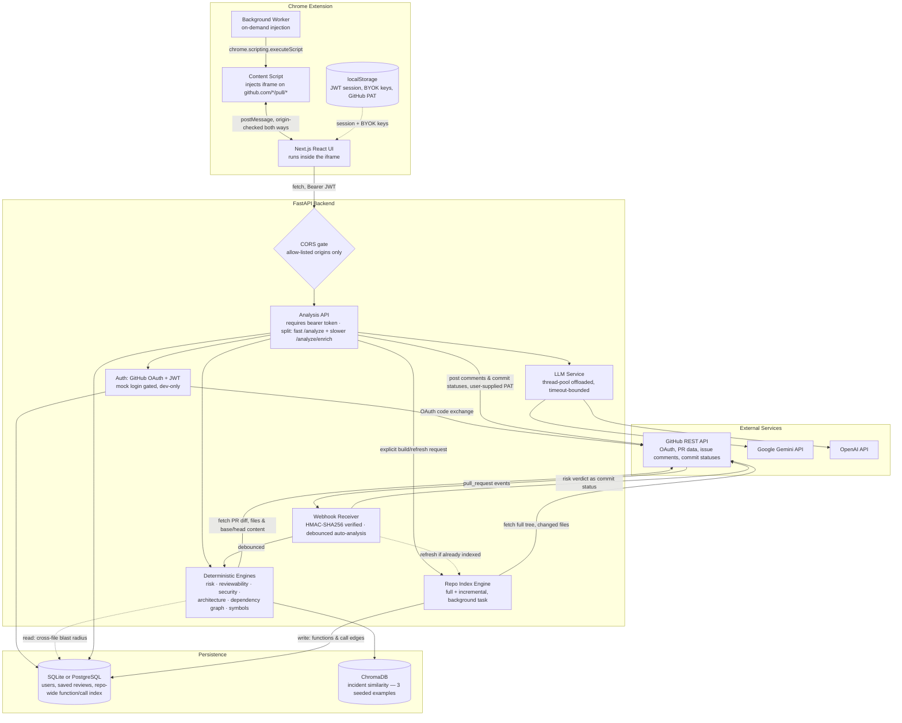

# PRScope - PR Review Intelligence

[Install PRScope from the Chrome Web Store](https://chromewebstore.google.com/detail/prscope/jfngcklfbiljgpoeehlkpkackahgopoc)


PRScope is a full-stack Chrome Extension and FastAPI platform that performs instant, comprehensive pull request reviews natively within the GitHub UI. It acts as an autonomous agent that deeply analyzes structural code changes, flags common known-vulnerability patterns, maps downstream dependency impacts, and generates actionable, 1-click inline code comments using advanced LLM reasoning.

Built for high-velocity engineering teams, PRScope significantly reduces the cognitive overhead required to review massive legacy refactors, complex dependency chains, and subtle architectural anti-patterns. Stop blindly merging code and gain deterministic x-ray vision into every pull request.

## Core Capabilities

### Deterministic Risk Assessment
Generates a quantifiable Risk Score (1-10) and a Reviewability Index based on rigid heuristics rather than stochastic LLM generation. Evaluates factors such as Line of Code (LOC) volatility, symbol modification density, test coverage deltas, PR description fidelity, and — for **Python files** — McCabe cyclomatic complexity, computed from an actual control-flow graph built for each added/modified function (not a LOC-based proxy), to triage the risk of a merge.

### Automated Security & Architecture Auditing
For **Python files**, added lines are scanned with [Bandit](https://bandit.readthedocs.io/), an established static-analysis security linter (hardcoded credentials, unsafe deserialization, command injection, weak crypto, and dozens of other checks), supplemented by a small set of deterministic pattern rules for gaps Bandit doesn't cover (e.g. generic `API_KEY`/`SECRET`/`TOKEN`-style hardcoded credential naming). For **all other file types** (JS/TS, etc.), detection falls back to the pattern rules alone. Either way, only *added* lines are scanned, and this doesn't detect unknown ("zero-day") vulnerability classes by design — it's built to catch known-bad patterns reliably, not to reason about novel exploits.

Architecture boundary rules (`.prscope.yml`) use the same approach: real AST-based import analysis for Python files (so it correctly ignores a restricted name merely mentioned in a comment or string, unlike naive text matching), with pattern-based detection as the fallback for non-Python files.

### Dynamic Architecture Verification (.prscope.yml)
Supports highly customized, repository-specific architectural rules. The engine dynamically fetches and parses `.prscope.yml` definitions from the target repository root, allowing engineering teams to enforce strict, bespoke module boundaries and import restrictions on a per-project basis.

### Causal Dependency Mapping & Visualization
For **Python and JS/TS files** (`.js`/`.jsx`/`.mjs`/`.cjs`/`.ts`/`.tsx`), fetches the real base and head commit content for each changed file from the GitHub Contents API and builds a call graph from the actual file (not a diff-hunk reconstruction), rendered as a visual dependency graph in the Chrome Extension UI. Because the whole file is parsed, calls made from or to code the diff didn't touch are captured correctly too — not just what's visible in the patch. Python parsing uses the `ast` module; JS/TS parsing uses [tree-sitter](https://tree-sitter.github.io/tree-sitter/) (the `tree-sitter-javascript`/`tree-sitter-typescript` grammars), so both a call like `foo()` and a method call like `this.bar()` are resolved the same way a Python `ast.Call`/`ast.Attribute` would be. By default this is still per-file, single-PR scope, not a full-repository index, so a caller in a different file won't show up — that's what the repo-wide index below is for. If real content can't be fetched (rate limits, huge PRs, deleted files), Python falls back to diff-fragment reconstruction; JS/TS files without real content are skipped entirely for the call graph rather than attempting a similarly lossy reconstruction. Other languages (Go, Java, Ruby, etc.) currently don't produce a dependency graph.

### Full-Repo Index & Cross-File Blast Radius
The "PR-local" call graph above only sees callers inside files the PR itself touched. On request (the extension's "Build Index" button, or `POST /index/build`), the backend does a one-time scan of the repository's default branch — walking the full Git tree, fetching every parseable file, and persisting every function/method definition and call edge it finds to the database (`repo_indexes`/`indexed_functions`/`indexed_calls`). Once built, every analysis of that repo enriches each modified/added function with `repo_wide_called_by`: callers found *anywhere* in the repo, not just this PR's changed files — including functions that would otherwise look "locally unconnected" and get filtered out of the report entirely. Later runs are incremental: the backend diffs the current default-branch head against the last indexed commit (GitHub's compare API) and only re-parses files that actually changed, instead of rescanning the whole repo again. A repo that has an active webhook (see below) also gets its index refreshed automatically as PR activity comes in, once it's been built at least once.

Known limitations, stated plainly: callee resolution is by bare name only (same tradeoff the PR-local graph already makes), so a common function name can match unrelated definitions elsewhere in the repo — this is an approximation, not a precise reference-resolution engine. The initial full build is capped at `MAX_FILES_PER_INDEX` (500) files and relies on GitHub's tree API, which itself truncates on very large repositories. Building the index is an explicit, opt-in action — running `/analyze` on a repo never triggers one on its own.

### Stateful Review Generation
Cross-references the pull request diff against provided Jira/Linear ticket context to ensure strict adherence to business requirements. Generates highly contextual, actionable inline comments that can be directly submitted to the GitHub timeline via the extension UI.

### GitHub Commit Status Publishing
The extension's "Publish Status" button posts the deterministic risk verdict (Approve / Needs Review / Request Changes) as a commit status on the PR's head commit via GitHub's Statuses API, so it shows up directly in the PR's own **Checks** section — not just inside the extension. This is a deliberately separate, explicit action from running an analysis, so `/analyze` never silently writes to a repository the caller doesn't intend to; it requires both a PRScope login and a GitHub Personal Access Token with `repo:status` scope (configured the same way as the existing inline-comment posting). Uses the Statuses API rather than the newer Checks API on purpose — Checks requires registering PRScope as a GitHub App with an installation-token flow, which is a larger undertaking than a PAT-based status; the tradeoff is a plainer single-line status instead of rich inline annotations.

### Bring Your Own Key (BYOK) Architecture
Users can bypass the shared API quota pool by supplying their own Gemini or OpenAI API key, persisted in the browser's local storage. Note this storage is **not encrypted** — treat it like any other locally-cached credential, and prefer a scoped/limited-privilege key where possible.

### GitHub Webhook Ingestion (signature-verified, CI-style automated analysis)
The FastAPI backend exposes a signature-verified `pull_request` webhook receiver (`opened`, `synchronize`, `reopened`), gated by `GITHUB_WEBHOOK_SECRET`. Requests without a valid `X-Hub-Signature-256` are rejected outright. A valid event schedules a deterministic analysis run, debounced per PR (`WEBHOOK_DEBOUNCE_SECONDS`, default 30s): a quick series of pushes fires several `synchronize` events in a row, and each new event for the same PR restarts that PR's timer instead of queuing its own run, so only the last push within the window actually gets analyzed. Once that run completes, the risk verdict is published back to GitHub as a commit status (via `settings.GITHUB_TOKEN` — there's no per-user PAT in a webhook context), the same mechanism described above under GitHub Commit Status Publishing. This makes the webhook a real (if lightweight) CI check: no task queue, no separate worker process — the debounce timer and the analysis both run as an `asyncio` task inside the same backend process, which is a reasonable tradeoff for one instance but wouldn't coordinate correctly across multiple backend replicas without a shared store.

### Resilient Inference & Rate Limit Handling
The LLM service layer implements robust exception boundaries to handle upstream API quotas gracefully, with bounded timeouts, retry-with-backoff (both providers), and thread-pool offloading so a slow provider response can't stall the whole API process. If global rate limits (HTTP 429) are exceeded, the platform automatically degrades into a deterministic heuristic mode, ensuring risk scores and dependency graphs are reliably delivered even during inference outages.

### Progressive Analysis (fast deterministic results, AI content streams in after)
Analysis is split into two calls: `POST /analyze` runs only the deterministic engines (risk score, security findings, architecture violations, dependency graph, reviewability) and returns in well under a second, since it never touches an LLM. `POST /analyze/enrich` then runs the LLM-generated content (executive summary, review checklist, suggested comments, Jira context, and AI explanations for security findings) separately, which can legitimately take a minute or more given the retry/backoff behavior above. The extension renders deterministic results the moment they arrive rather than blocking the whole UI on the slower call.

## Security Model

- **Login required.** Every analysis request and workspace operation requires a valid GitHub-issued session (JWT bearer token) — there is no anonymous access to `/analyze`.
- **JWT signing key is mandatory.** `JWT_SECRET` has no default and no fallback; the backend refuses to start without it. Rotate it and every existing session is invalidated.
- **Mock login is dev-only and off by default.** `ENABLE_MOCK_AUTH=true` unlocks a passwordless login path (`code=mock`) that skips GitHub OAuth entirely — never enable this on a deployed instance.
- **CORS is allow-listed, not wildcard.** Only the origins in `ALLOWED_ORIGINS` (the published extension ID + any local dev origins you add) can call the API.
- **Webhooks are signature-verified.** `GITHUB_WEBHOOK_SECRET` must be set and must match the secret configured on the GitHub webhook, or every event is rejected.
- **BYOK keys are stored, not encrypted.** Gemini/OpenAI keys and your GitHub PAT live in the extension's local storage in plaintext. Use scoped, minimally-privileged tokens.

## System Architecture

The platform follows a decoupled client-server model: the Chrome Extension stays lightweight and talks to a single FastAPI backend, which owns all LLM inference, deterministic analysis, persistence, and the outbound calls to GitHub's API.


```mermaid
graph TD
    subgraph Client [Chrome Extension]
        CS[Content Script<br/>injects iframe on github.com/*/pull/*]
        BS[Background Worker<br/>on-demand injection]
        UI[Next.js React UI<br/>runs inside the iframe]
        Storage[(localStorage<br/>JWT session, BYOK keys, GitHub PAT)]
    end

    subgraph Backend [FastAPI Backend]
        CORS{CORS gate<br/>allow-listed origins only}
        Auth[Auth: GitHub OAuth + JWT<br/>mock login gated, dev-only]
        API[Analysis API<br/>requires bearer token · split: fast /analyze + slower /analyze/enrich]
        Engines[Deterministic Engines<br/>risk · reviewability · security ·<br/>architecture · dependency graph · symbols]
        Indexer[Repo Index Engine<br/>full + incremental, background task]
        LLMSvc[LLM Service<br/>thread-pool offloaded, timeout-bounded]
        Webhook[Webhook Receiver<br/>HMAC-SHA256 verified · debounced auto-analysis]
    end

    subgraph Data [Persistence]
        DB[(SQLite or PostgreSQL<br/>users, saved reviews, repo-wide function/call index)]
        Chroma[(ChromaDB<br/>incident similarity — 3 seeded examples)]
    end

    subgraph External [External Services]
        GH[GitHub REST API<br/>OAuth, PR data, issue comments, commit statuses]
        Gemini[Google Gemini API]
        OpenAI[OpenAI API]
    end

    BS -->|chrome.scripting.executeScript| CS
    CS <-->|postMessage, origin-checked both ways| UI
    UI -->|fetch, Bearer JWT| CORS --> API
    Storage -.->|session + BYOK keys| UI

    API --> Auth
    Auth -->|OAuth code exchange| GH
    Auth --> DB
    API --> Engines
    Engines -->|fetch PR diff, files & base/head content| GH
    Engines -.->|read: cross-file blast radius| DB
    API -->|post comments & commit statuses, user-supplied PAT| GH
    Engines --> Chroma
    API --> LLMSvc
    LLMSvc --> Gemini
    LLMSvc --> OpenAI
    API --> DB
    API -->|explicit build/refresh request| Indexer
    Indexer -->|fetch full tree, changed files| GH
    Indexer -->|write: functions & call edges| DB

    GH -->|pull_request events| Webhook
    Webhook -->|debounced| Engines
    Webhook -.->|refresh if already indexed| Indexer
    Webhook -->|risk verdict as commit status| GH
```

## Usage Guide

To use the PRScope extension effectively on any GitHub repository:

1. **Installation:** [Install PRScope from the Chrome Web Store](https://chromewebstore.google.com/detail/prscope/jfngcklfbiljgpoeehlkpkackahgopoc), or load the unpacked `extension/out` directory locally (see Extension Setup below).
2. **Navigate to a PR:** Open any active Pull Request on GitHub. You will notice the PRScope interface seamlessly injected into the GitHub sidebar or as a floating panel.
3. **Authentication (required):** Click "Login with GitHub" to authenticate and generate a session token. Analysis will not run until you're logged in — you'll see a "Login Required" prompt otherwise.
4. **Configure BYOK (Optional but Recommended):** Click the **Settings (⚙️)** gear icon in the top right corner of the extension and enter your personal Gemini or OpenAI API key to bypass global rate limits and ensure unrestricted analysis. These are stored locally, unencrypted — see Security Model above.
5. **Run Analysis:** The extension automatically reads the PR diff, context, and issue descriptions. It will present a comprehensive Risk Assessment, Dependency Graph, Security Findings, and actionable Review Comments.
6. **Save Snapshots:** Use the "Copy Snapshot" button to instantly copy the AI-generated executive summary and findings to your clipboard, ready to be pasted as a formal GitHub review.

## Local Development Initialization

To run the application locally for contribution or self-hosting, follow the steps below.

### Prerequisites
- Python 3.11.x (recommended and pinned in CI — newer versions may lack prebuilt wheels for some pinned dependencies, notably `pydantic-core`)
- Node.js 18+
- PostgreSQL instance (or SQLite, the default, for local testing)
- Google Gemini and/or OpenAI API Key
- GitHub OAuth Application Credentials

### Backend Setup

1. Navigate to the backend directory and establish a virtual environment:
```bash
cd backend
python -m venv venv
source venv/bin/activate  # On Windows: venv\Scripts\activate
```

2. Install dependencies (pinned — see `requirements.txt`):
```bash
pip install -r requirements.txt
```

3. Configure environment variables:
```bash
cp .env.example .env
```
Then fill in `backend/.env`. At minimum you need a `JWT_SECRET` — the app will not start without one:
```bash
python -c "import secrets; print(secrets.token_urlsafe(48))"
```
See `.env.example` for the full list (`DATABASE_URL`, `GITHUB_CLIENT_ID`/`SECRET`, `ENABLE_MOCK_AUTH`, `GITHUB_WEBHOOK_SECRET`, `ALLOWED_ORIGINS`, LLM provider keys). Notes:
- Without a GitHub OAuth app configured, set `ENABLE_MOCK_AUTH=true` to log in locally without one — never set this in a deployed environment.
- `ALLOWED_ORIGINS` defaults to the published extension's ID; override it if you're running your own fork/build under a different extension ID.

4. Run the test suite:
```bash
pytest
```

5. Initialize the server:
```bash
uvicorn app.main:app --reload --port 8000
```

### Extension Setup

1. Navigate to the extension directory:
```bash
cd extension
npm install
```

2. Execute the build process:
```bash
npm run build
```

3. Load into Chrome:
- Navigate to `chrome://extensions/`
- Enable "Developer mode"
- Select "Load unpacked"
- Target the `extension/out` directory generated by the build process.

### CI

`.github/workflows/ci.yml` runs on every push/PR to `main`: the backend job installs pinned dependencies and runs `pytest`; the extension job typechecks (`tsc --noEmit`) and builds the actual Chrome extension bundle. Linting runs too but is currently informational (`continue-on-error`) pending cleanup of a few pre-existing findings unrelated to the app code (see the workflow file for specifics).

## License
MIT License. See `LICENSE` for more information.
