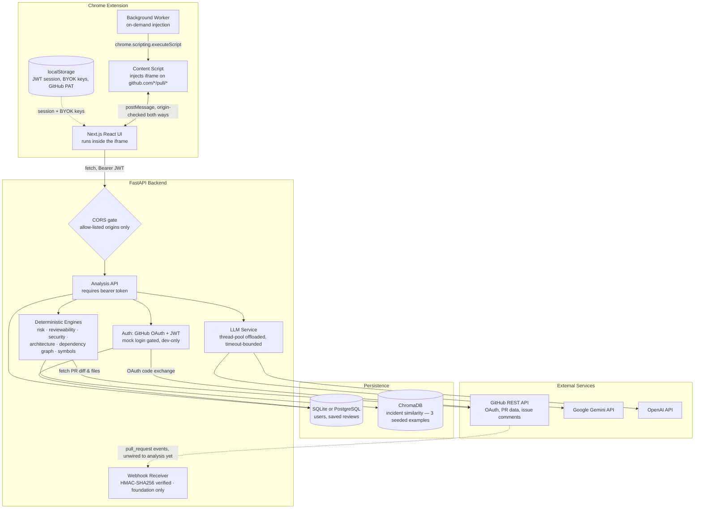

# PRScope - PR Review Intelligence

[Install PRScope from the Chrome Web Store](https://chromewebstore.google.com/detail/prscope/jfngcklfbiljgpoeehlkpkackahgopoc)


PRScope is a full-stack Chrome Extension and FastAPI platform that performs instant, comprehensive pull request reviews natively within the GitHub UI. It acts as an autonomous agent that deeply analyzes structural code changes, flags common known-vulnerability patterns, maps downstream dependency impacts, and generates actionable, 1-click inline code comments using advanced LLM reasoning.

Built for high-velocity engineering teams, PRScope significantly reduces the cognitive overhead required to review massive legacy refactors, complex dependency chains, and subtle architectural anti-patterns. Stop blindly merging code and gain deterministic x-ray vision into every pull request.

## Core Capabilities

### Deterministic Risk Assessment
Generates a quantifiable Risk Score (1-10) and a Reviewability Index based on rigid heuristics rather than stochastic LLM generation. Evaluates factors such as Line of Code (LOC) volatility, symbol modification density, test coverage deltas, and PR description fidelity to triage the risk of a merge.

### Automated Security & Architecture Auditing
Scans added lines in the diff against a deterministic set of pattern rules (hardcoded credentials, `eval`/`exec`, `shell=True`, unsafe deserialization, f-string SQL interpolation, and similar known-bad patterns) and flags configured module-boundary/import violations. This is single-line pattern matching, not a full SAST engine — it won't catch multi-line, obfuscated, or otherwise disguised issues, and it doesn't detect unknown ("zero-day") vulnerability classes by design.

### Dynamic Architecture Verification (.prscope.yml)
Supports highly customized, repository-specific architectural rules. The engine dynamically fetches and parses `.prscope.yml` definitions from the target repository root, allowing engineering teams to enforce strict, bespoke module boundaries and import restrictions on a per-project basis.

### Causal Dependency Mapping & Visualization
Parses the diff to build a best-effort call graph for **Python files** and renders it as a visual dependency graph in the Chrome Extension UI. The graph is built from diff context only (not the full file or full repository), so accuracy is naturally limited to what's visible in the patch, and non-Python files currently don't produce a dependency graph.

### Stateful Review Generation
Cross-references the pull request diff against provided Jira/Linear ticket context to ensure strict adherence to business requirements. Generates highly contextual, actionable inline comments that can be directly submitted to the GitHub timeline via the extension UI.

### Bring Your Own Key (BYOK) Architecture
Users can bypass the shared API quota pool by supplying their own Gemini or OpenAI API key, persisted in the browser's local storage. Note this storage is **not encrypted** — treat it like any other locally-cached credential, and prefer a scoped/limited-privilege key where possible.

### GitHub Webhook Ingestion (signature-verified, foundation only)
The FastAPI backend exposes a signature-verified `pull_request` webhook receiver (`opened`, `synchronize`, `reopened`), gated by `GITHUB_WEBHOOK_SECRET`. Requests without a valid `X-Hub-Signature-256` are rejected outright. Today it validates and logs the event; it does not yet dispatch analysis automatically. It's built as the foundation for future CI/CD-triggered background analysis (e.g. via a task queue), not a shipped feature yet.

### Resilient Inference & Rate Limit Handling
The LLM service layer implements robust exception boundaries to handle upstream API quotas gracefully, with bounded timeouts and thread-pool offloading so a slow provider response can't stall the whole API process. If global rate limits (HTTP 429) are exceeded, the platform automatically degrades into a deterministic heuristic mode, ensuring risk scores and dependency graphs are reliably delivered even during inference outages.

## Security Model

- **Login required.** Every analysis request and workspace operation requires a valid GitHub-issued session (JWT bearer token) — there is no anonymous access to `/analyze`.
- **JWT signing key is mandatory.** `JWT_SECRET` has no default and no fallback; the backend refuses to start without it. Rotate it and every existing session is invalidated.
- **Mock login is dev-only and off by default.** `ENABLE_MOCK_AUTH=true` unlocks a passwordless login path (`code=mock`) that skips GitHub OAuth entirely — never enable this on a deployed instance.
- **CORS is allow-listed, not wildcard.** Only the origins in `ALLOWED_ORIGINS` (the published extension ID + any local dev origins you add) can call the API.
- **Webhooks are signature-verified.** `GITHUB_WEBHOOK_SECRET` must be set and must match the secret configured on the GitHub webhook, or every event is rejected.
- **BYOK keys are stored, not encrypted.** Gemini/OpenAI keys and your GitHub PAT live in the extension's local storage in plaintext. Use scoped, minimally-privileged tokens.

## System Architecture

The platform follows a decoupled client-server model: the Chrome Extension stays lightweight and talks to a single FastAPI backend, which owns all LLM inference, deterministic analysis, persistence, and the outbound calls to GitHub's API.


```mermaid
graph TD
    subgraph Client [Chrome Extension]
        CS[Content Script<br/>injects iframe on github.com/*/pull/*]
        BS[Background Worker<br/>on-demand injection]
        UI[Next.js React UI<br/>runs inside the iframe]
        Storage[(localStorage<br/>JWT session, BYOK keys, GitHub PAT)]
    end

    subgraph Backend [FastAPI Backend]
        CORS{CORS gate<br/>allow-listed origins only}
        Auth[Auth: GitHub OAuth + JWT<br/>mock login gated, dev-only]
        API[Analysis API<br/>requires bearer token]
        Engines[Deterministic Engines<br/>risk · reviewability · security ·<br/>architecture · dependency graph · symbols]
        LLMSvc[LLM Service<br/>thread-pool offloaded, timeout-bounded]
        Webhook[Webhook Receiver<br/>HMAC-SHA256 verified · foundation only]
    end

    subgraph Data [Persistence]
        DB[(SQLite or PostgreSQL<br/>users, saved reviews)]
        Chroma[(ChromaDB<br/>incident similarity — 3 seeded examples)]
    end

    subgraph External [External Services]
        GH[GitHub REST API<br/>OAuth, PR data, issue comments]
        Gemini[Google Gemini API]
        OpenAI[OpenAI API]
    end

    BS -->|chrome.scripting.executeScript| CS
    CS <-->|postMessage, origin-checked both ways| UI
    UI -->|fetch, Bearer JWT| CORS --> API
    Storage -.->|session + BYOK keys| UI

    API --> Auth
    Auth -->|OAuth code exchange| GH
    Auth --> DB
    API --> Engines
    Engines -->|fetch PR diff & files| GH
    Engines --> Chroma
    API --> LLMSvc
    LLMSvc --> Gemini
    LLMSvc --> OpenAI
    API --> DB

    GH -.->|pull_request events, unwired to analysis yet| Webhook
```

## Usage Guide

To use the PRScope extension effectively on any GitHub repository:

1. **Installation:** [Install PRScope from the Chrome Web Store](https://chromewebstore.google.com/detail/prscope/jfngcklfbiljgpoeehlkpkackahgopoc), or load the unpacked `extension/out` directory locally (see Extension Setup below).
2. **Navigate to a PR:** Open any active Pull Request on GitHub. You will notice the PRScope interface seamlessly injected into the GitHub sidebar or as a floating panel.
3. **Authentication (required):** Click "Login with GitHub" to authenticate and generate a session token. Analysis will not run until you're logged in — you'll see a "Login Required" prompt otherwise.
4. **Configure BYOK (Optional but Recommended):** Click the **Settings (⚙️)** gear icon in the top right corner of the extension and enter your personal Gemini or OpenAI API key to bypass global rate limits and ensure unrestricted analysis. These are stored locally, unencrypted — see Security Model above.
5. **Run Analysis:** The extension automatically reads the PR diff, context, and issue descriptions. It will present a comprehensive Risk Assessment, Dependency Graph, Security Findings, and actionable Review Comments.
6. **Save Snapshots:** Use the "Copy Snapshot" button to instantly copy the AI-generated executive summary and findings to your clipboard, ready to be pasted as a formal GitHub review.

## Local Development Initialization

To run the application locally for contribution or self-hosting, follow the steps below.

### Prerequisites
- Python 3.11.x (recommended and pinned in CI — newer versions may lack prebuilt wheels for some pinned dependencies, notably `pydantic-core`)
- Node.js 18+
- PostgreSQL instance (or SQLite, the default, for local testing)
- Google Gemini and/or OpenAI API Key
- GitHub OAuth Application Credentials

### Backend Setup

1. Navigate to the backend directory and establish a virtual environment:
```bash
cd backend
python -m venv venv
source venv/bin/activate  # On Windows: venv\Scripts\activate
```

2. Install dependencies (pinned — see `requirements.txt`):
```bash
pip install -r requirements.txt
```

3. Configure environment variables:
```bash
cp .env.example .env
```
Then fill in `backend/.env`. At minimum you need a `JWT_SECRET` — the app will not start without one:
```bash
python -c "import secrets; print(secrets.token_urlsafe(48))"
```
See `.env.example` for the full list (`DATABASE_URL`, `GITHUB_CLIENT_ID`/`SECRET`, `ENABLE_MOCK_AUTH`, `GITHUB_WEBHOOK_SECRET`, `ALLOWED_ORIGINS`, LLM provider keys). Notes:
- Without a GitHub OAuth app configured, set `ENABLE_MOCK_AUTH=true` to log in locally without one — never set this in a deployed environment.
- `ALLOWED_ORIGINS` defaults to the published extension's ID; override it if you're running your own fork/build under a different extension ID.

4. Run the test suite:
```bash
pytest
```

5. Initialize the server:
```bash
uvicorn app.main:app --reload --port 8000
```

### Extension Setup

1. Navigate to the extension directory:
```bash
cd extension
npm install
```

2. Execute the build process:
```bash
npm run build
```

3. Load into Chrome:
- Navigate to `chrome://extensions/`
- Enable "Developer mode"
- Select "Load unpacked"
- Target the `extension/out` directory generated by the build process.

### CI

`.github/workflows/ci.yml` runs on every push/PR to `main`: the backend job installs pinned dependencies and runs `pytest`; the extension job typechecks (`tsc --noEmit`) and builds the actual Chrome extension bundle. Linting runs too but is currently informational (`continue-on-error`) pending cleanup of a few pre-existing findings unrelated to the app code (see the workflow file for specifics).

## License
MIT License. See `LICENSE` for more information.
