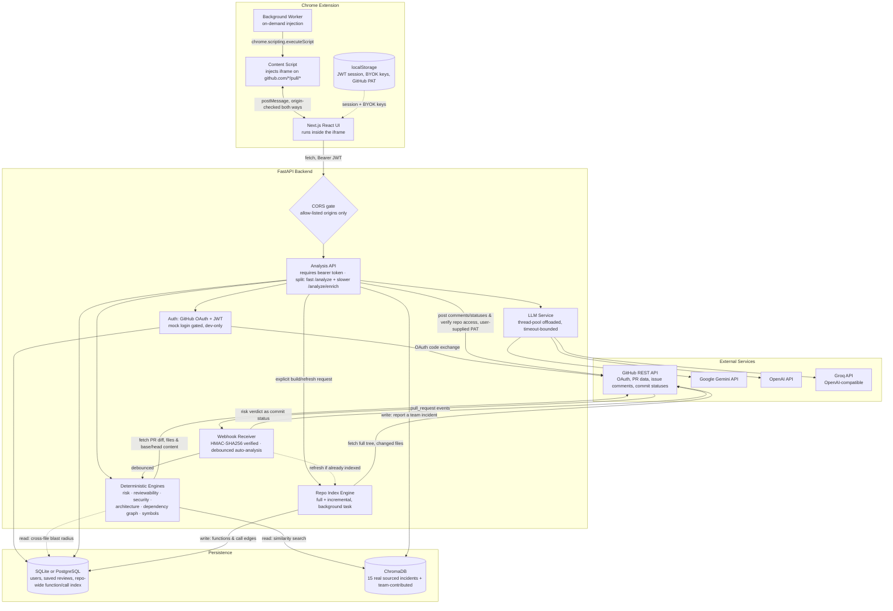

# PRScope - PR Review Intelligence
[](https://github.com/kankaniakshat185/prscope-pr-review-intelligence/actions/workflows/ci.yml)

[Install PRScope from the Chrome Web Store](https://chromewebstore.google.com/detail/prscope/jfngcklfbiljgpoeehlkpkackahgopoc)


PRScope is a full-stack Chrome Extension and FastAPI platform that performs instant, comprehensive pull request reviews natively within the GitHub UI. It acts as an autonomous agent that deeply analyzes structural code changes, flags common known-vulnerability patterns, maps downstream dependency impacts, and generates actionable, 1-click inline code comments using advanced LLM reasoning.

Built for high-velocity engineering teams, PRScope significantly reduces the cognitive overhead required to review massive legacy refactors, complex dependency chains, and subtle architectural anti-patterns. Stop blindly merging code and gain deterministic x-ray vision into every pull request.

## Core Capabilities

### Deterministic Risk Assessment
- Risk Score (1–10) + Reviewability Index from rigid heuristics, not LLM output
- Factors: LOC volatility, symbol modification density, test coverage deltas, PR description fidelity
- **Python:** McCabe cyclomatic complexity from a real control-flow graph per function — not a LOC-based proxy

### Automated Security & Architecture Auditing
- **Python:** added lines scanned with [Bandit](https://bandit.readthedocs.io/) (hardcoded credentials, unsafe deserialization, command injection, weak crypto, dozens more), supplemented by pattern rules for gaps Bandit misses (e.g. generic `API_KEY`/`SECRET`/`TOKEN` naming)
- **All other languages:** pattern rules only
- Only *added* lines are scanned; catches known-bad patterns by design, not novel/zero-day exploits
- Architecture rules (`.prscope.yml`) use the same split: real AST-based import analysis for Python (ignores a restricted name merely mentioned in a comment or string), pattern-based fallback elsewhere

### Dynamic Architecture Verification (.prscope.yml)
- Fetches and parses a `.prscope.yml` from the target repo root at analysis time
- Lets teams enforce bespoke module boundaries and import restrictions per project

### Causal Dependency Mapping & Visualization
- **Python + JS/TS** (`.js`/`.jsx`/`.mjs`/`.cjs`/`.ts`/`.tsx`): fetches real base/head file content and builds the call graph from the actual file, not a diff-hunk reconstruction — so calls the diff never touched are still captured
- Python via the `ast` module; JS/TS via [tree-sitter](https://tree-sitter.github.io/tree-sitter/), resolving both `foo()` and `this.bar()`-style calls
- Per-file, single-PR scope by default — a caller in a different file needs the repo-wide index below
- Fallback: Python reconstructs from the diff if real content is unavailable; JS/TS is skipped rather than reconstructed (less reliable for that grammar)
- No dependency graph yet for other languages (Go, Java, Ruby, etc.)

### Full-Repo Index & Cross-File Blast Radius
- Opt-in, explicit action ("Build Index" button / `POST /index/build`) — a one-time scan of the repo's default branch, persisting every function/call edge found
- Enriches every analysis with `repo_wide_called_by`: callers anywhere in the repo, not just this PR's files — rescues functions that would otherwise look unconnected and get filtered out entirely
- Later runs are incremental — diffs against the last-indexed commit and only re-parses what changed
- Auto-refreshes off webhook activity, but only for a repo that's already been indexed once
- **Limitations:** bare-name callee resolution only (approximate, same tradeoff as the PR-local graph); capped at 500 files per build; inherits GitHub's own tree-API truncation on very large repos

### Stateful Review Generation
- Cross-references the PR diff against provided Jira/Linear ticket context
- Generates contextual inline comments, submittable directly to the GitHub timeline

### Team-Shared Saved Reviews
- "Team Reviews" toggle (Workspace tab) shows everyone's saved reviews for the currently-open repo, each attributed to its author
- Access is gated on a **live GitHub permission check** against a PAT the requesting user supplies (the same one used for posting comments/status), not on review history. A private repo grants access on any successful (non-404) fetch — GitHub itself 404s private repos for non-collaborators. A public repo specifically requires push/admin permission, since read access to a public repo is universal and proves nothing about real team membership
- This replaced an earlier, weaker version of this gate ("have you saved a review in this repo before") that any PRScope user could trivially satisfy for any repo the shared backend's own token could see, regardless of their own GitHub access — caught before release, not after
- Saving/editing stays per-user; nothing is merged or overwritten across teammates

### Team-Contributed Incidents
- Anyone can report a real incident from their repo (description + severity) via the Historical Incidents panel
- Embedded into the same ChromaDB collection immediately — factored into every subsequent similarity search, no separate ingestion step
- A repo's own contributions are listed back separately (`GET /incidents?repository=...`) from the global reference set

### Real, Sourced Incident Data + Measured Retrieval Quality
- Reference set is 15 real, publicly-documented incidents (Knight Capital 2012, GitLab.com 2017, Cloudflare 2019, Heartbleed, Log4Shell, CrowdStrike 2024, and more), each with a source citation — not placeholder text
- Retrieval quality is *measured*, not assumed: 15 hand-labeled queries run through a precision@k evaluation, asserted as regression-tested minimums (`tests/test_retrieval_eval.py`)
- Measured results: **93% precision@1**, **100% hit-rate@3**
- That evaluation caught a real bug — the display threshold was hiding 12 of 15 correct matches from users despite correct ranking; recalibrated from the measured score distributions, now surfaces 14 of 15

### GitHub Commit Status Publishing
- "Publish Status" button posts the risk verdict as a commit status on the PR's head commit (GitHub Statuses API) — visible in the PR's own **Checks** section
- A separate, explicit action from running analysis — `/analyze` itself never writes to a repo
- Requires a PRScope login + a GitHub PAT with `repo:status` scope
- Uses the Statuses API, not the newer Checks API (which needs a full GitHub App) — simpler, at the cost of a plain single-line status instead of rich inline annotations

### Bring Your Own Key (BYOK) Architecture
- Bypass the shared quota pool with your own Gemini, OpenAI, or Groq key, stored in browser local storage
- Groq is a genuinely free, generously-rate-limited option if you don't already have a key elsewhere — an OpenAI-compatible API, so it reuses the same request path as the OpenAI provider
- **Not encrypted** — treat it like any other locally-cached credential; prefer scoped/limited-privilege keys

### GitHub Webhook Ingestion (CI-style automated analysis)
- Signature-verified `pull_request` receiver (`opened`/`synchronize`/`reopened`), gated by `GITHUB_WEBHOOK_SECRET`
- Debounced per PR (default 30s) — a burst of pushes triggers one analysis, not one per push
- Publishes the risk verdict back as a commit status automatically, using the server's shared token
- Runs as an in-process `asyncio` task — fine for one backend instance, wouldn't coordinate across multiple replicas without a shared store

### Resilient Inference & Rate Limit Handling
- Bounded timeouts, retry-with-backoff on all three LLM providers, thread-pool offloading so a slow provider can't stall the API process
- Automatically degrades to deterministic-only mode if global rate limits are hit
- The AI half of an analysis makes **at most 2 LLM calls total**, not up to ~14: one batched call explains every security finding together (previously one call *per finding*), and one combined call produces the checklist, suggested comments, executive summary, and Jira context together (previously four separate calls) — see `generate_review_bundle`/`explain_security_findings_batch` in `llm.py`. This is the main defense against exhausting a shared free-tier key's quota, not just a longer retry loop.
- Calls that expect structured output pass `json_mode=True`, which forces each provider's own native JSON mode (`response_format: json_object` for OpenAI/Groq, `response_mime_type` for Gemini) rather than relying on prompt instructions alone. Found in production: Groq's Llama model is noticeably less reliable than GPT-4o/Gemini at spontaneously returning clean JSON without this — real users hit "AI Response Could Not Be Parsed" until this was added.

### Progressive Analysis (fast deterministic results, AI content streams in after)
- `POST /analyze`: deterministic engines only — returns in well under a second, never touches an LLM
- `POST /analyze/enrich`: LLM-generated content (summary, checklist, comments, Jira context), fetched separately, can take a minute+
- Extension renders deterministic results immediately rather than blocking on the slower call

## Security Model

- **Login required.** Every analysis request and workspace operation requires a valid GitHub-issued session (JWT bearer token) — there is no anonymous access to `/analyze`.
- **JWT signing key is mandatory.** `JWT_SECRET` has no default and no fallback; the backend refuses to start without it. Rotate it and every existing session is invalidated.
- **Mock login is dev-only and off by default.** `ENABLE_MOCK_AUTH=true` unlocks a passwordless login path (`code=mock`) that skips GitHub OAuth entirely — never enable this on a deployed instance.
- **CORS is allow-listed, not wildcard.** Only the origins in `ALLOWED_ORIGINS` (the published extension ID + any local dev origins you add) can call the API.
- **Webhooks are signature-verified.** `GITHUB_WEBHOOK_SECRET` must be set and must match the secret configured on the GitHub webhook, or every event is rejected.
- **BYOK keys are stored, not encrypted.** Gemini/OpenAI/Groq keys and your GitHub PAT live in the extension's local storage in plaintext. Use scoped, minimally-privileged tokens.
- **Team-shared saved reviews require a verified GitHub permission check.** Viewing another user's saved review for a repository requires a live GitHub API check (via your own PAT) proving real access to that repo — not merely having used PRScope on it before. See Team-Shared Saved Reviews above.

## System Architecture

The platform follows a decoupled client-server model: the Chrome Extension stays lightweight and talks to a single FastAPI backend, which owns all LLM inference, deterministic analysis, persistence, and the outbound calls to GitHub's API.


```mermaid
graph TD
    subgraph Client [Chrome Extension]
        CS[Content Script<br/>injects iframe on github.com/*/pull/*]
        BS[Background Worker<br/>on-demand injection]
        UI[Next.js React UI<br/>runs inside the iframe]
        Storage[(localStorage<br/>JWT session, BYOK keys, GitHub PAT)]
    end

    subgraph Backend [FastAPI Backend]
        CORS{CORS gate<br/>allow-listed origins only}
        Auth[Auth: GitHub OAuth + JWT<br/>mock login gated, dev-only]
        API[Analysis API<br/>requires bearer token · split: fast /analyze + slower /analyze/enrich]
        Engines[Deterministic Engines<br/>risk · reviewability · security ·<br/>architecture · dependency graph · symbols]
        Indexer[Repo Index Engine<br/>full + incremental, background task]
        LLMSvc[LLM Service<br/>thread-pool offloaded, timeout-bounded]
        Webhook[Webhook Receiver<br/>HMAC-SHA256 verified · debounced auto-analysis]
    end

    subgraph Data [Persistence]
        DB[(SQLite or PostgreSQL<br/>users, saved reviews, repo-wide function/call index)]
        Chroma[(ChromaDB<br/>15 real sourced incidents + team-contributed)]
    end

    subgraph External [External Services]
        GH[GitHub REST API<br/>OAuth, PR data, issue comments, commit statuses]
        Gemini[Google Gemini API]
        OpenAI[OpenAI API]
        Groq[Groq API<br/>OpenAI-compatible]
    end

    BS -->|chrome.scripting.executeScript| CS
    CS <-->|postMessage, origin-checked both ways| UI
    UI -->|fetch, Bearer JWT| CORS --> API
    Storage -.->|session + BYOK keys| UI

    API --> Auth
    Auth -->|OAuth code exchange| GH
    Auth --> DB
    API --> Engines
    Engines -->|fetch PR diff, files & base/head content| GH
    Engines -.->|read: cross-file blast radius| DB
    API -->|post comments/statuses & verify repo access, user-supplied PAT| GH
    Engines -->|read: similarity search| Chroma
    API -->|write: report a team incident| Chroma
    API --> LLMSvc
    LLMSvc --> Gemini
    LLMSvc --> OpenAI
    LLMSvc --> Groq
    API --> DB
    API -->|explicit build/refresh request| Indexer
    Indexer -->|fetch full tree, changed files| GH
    Indexer -->|write: functions & call edges| DB

    GH -->|pull_request events| Webhook
    Webhook -->|debounced| Engines
    Webhook -.->|refresh if already indexed| Indexer
    Webhook -->|risk verdict as commit status| GH
```

## Usage Guide

To use the PRScope extension effectively on any GitHub repository:

1. **Installation:** [Install PRScope from the Chrome Web Store](https://chromewebstore.google.com/detail/prscope/jfngcklfbiljgpoeehlkpkackahgopoc), or load the unpacked `extension/out` directory locally (see Extension Setup below).
2. **Navigate to a PR:** Open any active Pull Request on GitHub. You will notice the PRScope interface seamlessly injected into the GitHub sidebar or as a floating panel.
3. **Authentication (required):** Click "Login with GitHub" to authenticate and generate a session token. Analysis will not run until you're logged in — you'll see a "Login Required" prompt otherwise.
4. **Configure BYOK (Optional but Recommended):** Click the **Settings (⚙️)** gear icon in the top right corner of the extension and enter your personal Gemini or OpenAI API key to bypass global rate limits and ensure unrestricted analysis. These are stored locally, unencrypted — see Security Model above.
5. **Run Analysis:** The extension automatically reads the PR diff, context, and issue descriptions. It will present a comprehensive Risk Assessment, Dependency Graph, Security Findings, and actionable Review Comments.
6. **Save Snapshots:** Use the "Copy Snapshot" button to instantly copy the AI-generated executive summary and findings to your clipboard, ready to be pasted as a formal GitHub review.

## Local Development Initialization

To run the application locally for contribution or self-hosting, follow the steps below.

### Prerequisites
- Python 3.11.x (recommended and pinned in CI — newer versions may lack prebuilt wheels for some pinned dependencies, notably `pydantic-core`)
- Node.js 18+
- PostgreSQL instance (or SQLite, the default, for local testing)
- Google Gemini and/or OpenAI API Key
- GitHub OAuth Application Credentials

### Backend Setup

1. Navigate to the backend directory and establish a virtual environment:
```bash
cd backend
python -m venv venv
source venv/bin/activate  # On Windows: venv\Scripts\activate
```

2. Install dependencies (pinned — see `requirements.txt`):
```bash
pip install -r requirements.txt
```

3. Configure environment variables:
```bash
cp .env.example .env
```
Then fill in `backend/.env`. At minimum you need a `JWT_SECRET` — the app will not start without one:
```bash
python -c "import secrets; print(secrets.token_urlsafe(48))"
```
See `.env.example` for the full list (`DATABASE_URL`, `GITHUB_CLIENT_ID`/`SECRET`, `ENABLE_MOCK_AUTH`, `GITHUB_WEBHOOK_SECRET`, `ALLOWED_ORIGINS`, LLM provider keys). Notes:
- Without a GitHub OAuth app configured, set `ENABLE_MOCK_AUTH=true` to log in locally without one — never set this in a deployed environment.
- `ALLOWED_ORIGINS` defaults to the published extension's ID; override it if you're running your own fork/build under a different extension ID.

4. Run the test suite:
```bash
pytest
```

5. Initialize the server:
```bash
uvicorn app.main:app --reload --port 8000
```

### Extension Setup

1. Navigate to the extension directory:
```bash
cd extension
npm install
```

2. Execute the build process:
```bash
npm run build
```

3. Load into Chrome:
- Navigate to `chrome://extensions/`
- Enable "Developer mode"
- Select "Load unpacked"
- Target the `extension/out` directory generated by the build process.

### CI

`.github/workflows/ci.yml` runs on every push/PR to `main`: the backend job installs pinned dependencies and runs `pytest`; the extension job typechecks (`tsc --noEmit`), builds the actual Chrome extension bundle, and lints — all blocking.

## License
MIT License. See `LICENSE` for more information.
