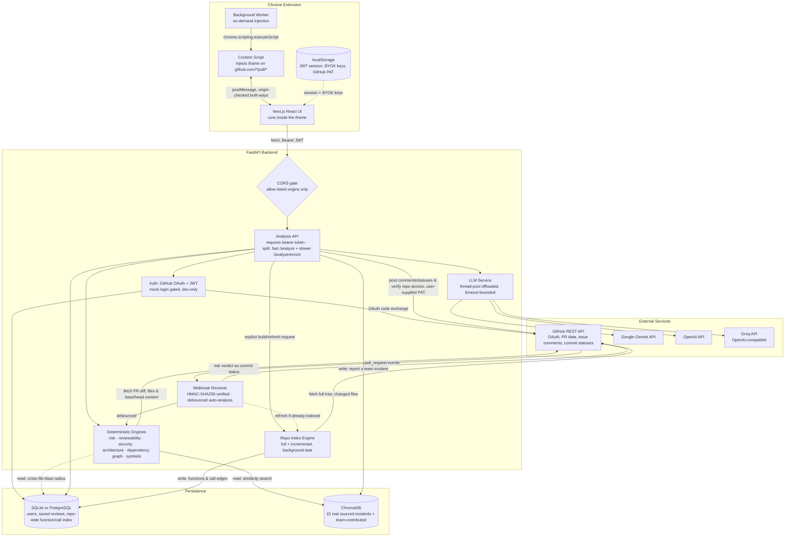

<h1 align="center">PRScope - PR Review Intelligence</h1>


**Live Demo:** [Install PRScope from the Chrome Web Store](https://chromewebstore.google.com/detail/prscope/jfngcklfbiljgpoeehlkpkackahgopoc)


PRScope is a full-stack Chrome Extension and FastAPI platform that performs instant, comprehensive pull request reviews natively within the GitHub UI. It acts as an autonomous agent that deeply analyzes structural code changes, flags common known-vulnerability patterns, maps downstream dependency impacts, and generates actionable, 1-click inline code comments using advanced LLM reasoning.

Built for high-velocity engineering teams, PRScope significantly reduces the cognitive overhead required to review massive legacy refactors, complex dependency chains, and subtle architectural anti-patterns. Stop blindly merging code and gain deterministic x-ray vision into every pull request.

## Features

- **Deterministic Risk Assessment** — Risk score + reviewability index from real heuristics (LOC volatility, symbol density, test coverage, cyclomatic complexity via actual control-flow graphs) — not LLM output.
- **Security & Architecture Auditing** — Bandit-based vulnerability scanning and AST-based import/architecture rule enforcement for Python, pattern-based fallback for other languages, with support for custom per-repo rules (`.prscope.yml`).
- **Multi-Language Dependency Graph** — Real call-graph construction from actual file content (Python `ast`, JS/TS via tree-sitter), plus an opt-in, incrementally-updated full-repo index surfacing cross-file "blast radius" callers a single-PR diff would miss.
- **AI-Assisted Review** — LLM-generated executive summaries, review checklists, and inline comment suggestions cross-referenced against Jira ticket context — kept fully separate from the deterministic analysis above.
- **Historical Incident Matching** — Retrieval-augmented matching against 15 real, sourced software incidents plus team-contributed ones, with measured retrieval quality (93% precision@1) on a labeled evaluation set.
- **Team Collaboration** — Shared review visibility across teammates, gated on a live GitHub permission check (not just review history), and a team-contributed incident database.
- **GitHub Integration** — Posts AI comments and publishes risk verdicts as commit statuses directly to the PR; optional signature-verified webhooks auto-trigger debounced analysis on push.
- **Bring Your Own Key** — Use your own Gemini, OpenAI, or Groq key to bypass the shared rate-limited pool.
- **Fast & Reliable** — Deterministic results return in under a second, independent of AI content; LLM calls are batched down to 2 per analysis with retry/backoff and structured-output enforcement across all three providers.

## System Architecture

The platform follows a decoupled client-server model: the Chrome Extension stays lightweight and talks to a single FastAPI backend, which owns all LLM inference, deterministic analysis, persistence, and the outbound calls to GitHub's API.


```mermaid
graph TD
    subgraph Client [Chrome Extension]
        CS[Content Script<br/>injects iframe on github.com/*/pull/*]
        BS[Background Worker<br/>on-demand injection]
        UI[Next.js React UI<br/>runs inside the iframe]
        Storage[(localStorage<br/>JWT session, BYOK keys, GitHub PAT)]
    end

    subgraph Backend [FastAPI Backend]
        CORS{CORS gate<br/>allow-listed origins only}
        Auth[Auth: GitHub OAuth + JWT<br/>mock login gated, dev-only]
        API[Analysis API<br/>requires bearer token · split: fast /analyze + slower /analyze/enrich]
        Engines[Deterministic Engines<br/>risk · reviewability · security ·<br/>architecture · dependency graph · symbols]
        Indexer[Repo Index Engine<br/>full + incremental, background task]
        LLMSvc[LLM Service<br/>thread-pool offloaded, timeout-bounded]
        Webhook[Webhook Receiver<br/>HMAC-SHA256 verified · debounced auto-analysis]
    end

    subgraph Data [Persistence]
        DB[(SQLite or PostgreSQL<br/>users, saved reviews, repo-wide function/call index)]
        Chroma[(ChromaDB<br/>15 real sourced incidents + team-contributed)]
    end

    subgraph External [External Services]
        GH[GitHub REST API<br/>OAuth, PR data, issue comments, commit statuses]
        Gemini[Google Gemini API]
        OpenAI[OpenAI API]
        Groq[Groq API<br/>OpenAI-compatible]
    end

    BS -->|chrome.scripting.executeScript| CS
    CS <-->|postMessage, origin-checked both ways| UI
    UI -->|fetch, Bearer JWT| CORS --> API
    Storage -.->|session + BYOK keys| UI

    API --> Auth
    Auth -->|OAuth code exchange| GH
    Auth --> DB
    API --> Engines
    Engines -->|fetch PR diff, files & base/head content| GH
    Engines -.->|read: cross-file blast radius| DB
    API -->|post comments/statuses & verify repo access, user-supplied PAT| GH
    Engines -->|read: similarity search| Chroma
    API -->|write: report a team incident| Chroma
    API --> LLMSvc
    LLMSvc --> Gemini
    LLMSvc --> OpenAI
    LLMSvc --> Groq
    API --> DB
    API -->|explicit build/refresh request| Indexer
    Indexer -->|fetch full tree, changed files| GH
    Indexer -->|write: functions & call edges| DB

    GH -->|pull_request events| Webhook
    Webhook -->|debounced| Engines
    Webhook -.->|refresh if already indexed| Indexer
    Webhook -->|risk verdict as commit status| GH
```

## Security Model

- **Login required.** Every analysis request and workspace operation requires a valid GitHub-issued session (JWT bearer token) — there is no anonymous access to `/analyze`.
- **JWT signing key is mandatory.** `JWT_SECRET` has no default and no fallback; the backend refuses to start without it. Rotate it and every existing session is invalidated.
- **Mock login is dev-only and off by default.** `ENABLE_MOCK_AUTH=true` unlocks a passwordless login path (`code=mock`) that skips GitHub OAuth entirely — never enable this on a deployed instance.
- **CORS is allow-listed, not wildcard.** Only the origins in `ALLOWED_ORIGINS` (the published extension ID + any local dev origins you add) can call the API.
- **Webhooks are signature-verified.** `GITHUB_WEBHOOK_SECRET` must be set and must match the secret configured on the GitHub webhook, or every event is rejected.
- **BYOK keys are stored, not encrypted.** Gemini/OpenAI/Groq keys and your GitHub PAT live in the extension's local storage in plaintext. Use scoped, minimally-privileged tokens.
- **Team-shared saved reviews require a verified GitHub permission check.** Viewing another user's saved review for a repository requires a live GitHub API check (via your own PAT) proving real access to that repo — not merely having used PRScope on it before. See Team Collaboration above.

## Usage Guide

To use the PRScope extension effectively on any GitHub repository:

1. **Installation:** [Install PRScope from the Chrome Web Store](https://chromewebstore.google.com/detail/prscope/jfngcklfbiljgpoeehlkpkackahgopoc), or load the unpacked `extension/out` directory locally (see Local Development Initialization below).
2. **Navigate to a PR:** Open any active Pull Request on GitHub. You will notice the PRScope interface seamlessly injected into the GitHub sidebar or as a floating panel upon clicking the PRScope icon in the extensions bar.
3. **Authentication (required):** Click "Login with GitHub" to authenticate and generate a session token. Analysis will not run until you're logged in — you'll see a "Login Required" prompt otherwise.
4. **Configure BYOK (Optional but Recommended):** Click the **Settings (⚙️)** gear icon in the top right corner of the extension and enter your personal Gemini, OpenAI, or Groq API key to bypass global rate limits and ensure unrestricted analysis. These are stored locally, unencrypted — see Security Model above.
5. **Run Analysis:** The extension automatically reads the PR diff, context, and issue descriptions. It will present a comprehensive Risk Assessment, Dependency Graph, Security Findings, and actionable Review Comments.
6. **Save Snapshots:** Use the "Copy Snapshot" button to instantly copy the AI-generated executive summary and findings to your clipboard, ready to be pasted as a formal GitHub review.

## Tech Stack

| Layer | Choice |
|---|---|
| Backend | Python, FastAPI, SQLAlchemy 2.0, Pydantic v2 |
| Database | PostgreSQL (Neon, production) — SQLite by default for local dev |
| Vector store | ChromaDB — incident similarity search |
| Background work | None — in-memory `asyncio` tasks (webhook debounce, rate limiting); no Celery/Redis, see Limitations |
| LLM synthesis | Gemini, OpenAI, Groq — BYOK or shared rate-limited pool |
| Auth | GitHub OAuth 2.0 (login) + JWT bearer sessions |
| Static analysis | Bandit (security), Python `ast` + tree-sitter (JS/TS) for parsing, NetworkX for call graphs |
| Frontend | Next.js (App Router, static export), React, TypeScript, Tailwind CSS |
| CI | GitHub Actions — pytest (backend), `tsc` + ESLint + build (extension), both blocking |
| Hosting | Render (backend), Neon (Postgres), Chrome Web Store (extension — no separate frontend host) |

## Engineering Decisions That Mattered

Full writeups — problem, approach, result, tradeoff — live in [`docs/decisions/`](docs/decisions/). Summaries below.

### 1. Empirically calibrated incident-retrieval threshold
**Problem:** deciding whether a past incident is genuinely *related* to a PR — not just superficially similar — needs a cutoff on the similarity score.
**Approach:** measured real score distributions against a hand-labeled 15-query eval set instead of guessing a round number.
**Result:** the original threshold (`60`, set in an early 3-stub-incident era) silently hid 12 of 15 genuine matches. Recalibrated to `35` — precision@1 measured at 93%, hit-rate@3 at 100%. → [full writeup](docs/decisions/0001-incident-retrieval-threshold.md)

### 2. Consolidating LLM calls under real rate-limit pressure
**Problem:** a single analysis fired up to ~14 separate LLM calls, and the shared free-tier Gemini pool started getting rate-limited in production.
**Approach:** merged review generation into one call and per-finding explanations into another, added Groq as a third provider, and forced provider-native structured output (`json_mode`) after Groq was observed returning malformed JSON on prose instructions alone.
**Result:** at most 2 LLM calls per analysis, down from ~14. → [full writeup](docs/decisions/0002-llm-call-consolidation.md)

### 3. Team-shared review visibility: a live permission check, not review history
**Problem:** the original team-visibility gate ("have you analyzed this repo before") proved nothing about the viewer's actual access.
**Approach:** replaced it with a live GitHub API check against the viewer's own PAT.
**Result:** real access control — and surfaced a real CORS bug (a custom header silently blocked by browser preflight) that a `TestClient` hitting routes directly would never catch. → [full writeup](docs/decisions/0003-team-review-access-verification.md)

### 4. A non-atomic check-then-insert on first login
**Problem:** brand-new users intermittently hit a raw 500 on their first-ever login, working fine on retry.
**Approach:** root-caused to a check-then-insert race against a unique DB constraint; fixed with a catch/rollback/re-query recovery path.
**Result:** a test that reproduces the actual race, not just the code path. → [full writeup](docs/decisions/0004-login-race-condition-fix.md)

## Testing and Correctness

```
208 backend tests passing · pytest, run in CI on every push/PR to main
```

- **Unit** — mocks LLM providers, the GitHub API, and ChromaDB at the boundary; tests each engine's own logic (risk scoring, reviewability, security findings, dependency graph, complexity, symbols, retrieval).
- **Regression** — dedicated tests for real bugs found and fixed in this project: the login race condition, the CORS preflight gap, Gemini's retired model, Groq's malformed-JSON output. Each reproduces the actual failure, not just asserts the fix exists.
- **Retrieval evaluation** — `retrieval_eval.py` runs precision@k / hit-rate@k against the hand-labeled 15-query set — the same methodology behind the threshold recalibration above.
- **Frontend** — no automated test suite yet; CI runs `tsc --noEmit`, ESLint, and a real production build (all blocking), but no Jest/Playwright coverage. The test investment went into backend correctness.

## Local Development Initialization

To run the application locally for contribution or self-hosting, follow the steps below.

### Prerequisites
- Python 3.11.x (recommended and pinned in CI — newer versions may lack prebuilt wheels for some pinned dependencies, notably `pydantic-core`)
- Node.js 18+
- PostgreSQL instance (or SQLite, the default, for local testing)
- Google Gemini, OpenAI, and/or Groq API key
- GitHub OAuth Application Credentials

### Backend Setup

1. Navigate to the backend directory and establish a virtual environment:
```bash
cd backend
python -m venv venv
source venv/bin/activate  # On Windows: venv\Scripts\activate
```

2. Install dependencies (pinned — see `requirements.txt`):
```bash
pip install -r requirements.txt
```

3. Configure environment variables:
```bash
cp .env.example .env
```
Then fill in `backend/.env`. At minimum you need a `JWT_SECRET` — the app will not start without one:
```bash
python -c "import secrets; print(secrets.token_urlsafe(48))"
```
See `.env.example` for the full list (`DATABASE_URL`, `GITHUB_CLIENT_ID`/`SECRET`, `ENABLE_MOCK_AUTH`, `GITHUB_WEBHOOK_SECRET`, `ALLOWED_ORIGINS`, LLM provider keys). Notes:
- Without a GitHub OAuth app configured, set `ENABLE_MOCK_AUTH=true` to log in locally without one — never set this in a deployed environment.
- `ALLOWED_ORIGINS` defaults to the published extension's ID; override it if you're running your own fork/build under a different extension ID.

4. Run the test suite:
```bash
pytest
```

5. Initialize the server:
```bash
uvicorn app.main:app --reload --port 8000
```

### Extension Setup

1. Navigate to the extension directory:
```bash
cd extension
npm install
```

2. Execute the build process:
```bash
npm run build
```

3. Load into Chrome:
- Navigate to `chrome://extensions/`
- Enable "Developer mode"
- Select "Load unpacked"
- Target the `extension/out` directory generated by the build process.

### CI

`.github/workflows/ci.yml` runs on every push/PR to `main`: the backend job installs pinned dependencies and runs `pytest`; the extension job typechecks (`tsc --noEmit`), builds the actual Chrome extension bundle, and lints — all blocking.

## Project Structure

```
backend/
├── app/
│   ├── main.py          # FastAPI app: CORS, router registration, startup (init_db, seed incidents)
│   ├── api/endpoints.py # all routes
│   ├── core/config.py   # env-driven settings (JWT_SECRET, DB, provider keys, CORS origins)
│   ├── models/pr.py     # SQLAlchemy models + session
│   ├── schemas/pr.py    # Pydantic request/response shapes
│   ├── data/            # real sourced incidents + the labeled eval query set
│   └── services/        # engines: risk, reviewability, security, architecture,
│                         # dependency graph, complexity, symbols, tree-sitter,
│                         # repo index, incident similarity, retrieval eval,
│                         # llm, github, webhook debouncer, rate limiter
└── tests/                # 33 files — one per engine/route, plus regression tests
extension/
├── public/                # manifest.json, content.js, background.js, icons
└── src/
    ├── app/                # Next.js App Router entry (page.tsx, layout.tsx)
    ├── components/         # PrReviewPanel, DependencyGraph, SavedReviewsPanel,
    │                        # SettingsPanel, AuthBar, ui/ primitives
    └── lib/                # useAnalysis hook, types, styles, utils
docs/
└── decisions/              # engineering decisions above, in full — problem, approach, result, tradeoff
```

## Deployment

- **Backend** — FastAPI on Render, a single web service (no separate worker process — there's nothing to background; see Limitations). `JWT_SECRET`, `GITHUB_CLIENT_ID`/`SECRET`, `GITHUB_WEBHOOK_SECRET`, and the LLM provider keys are set as Render environment variables.
- **Database** — PostgreSQL on Neon in production; defaults to a local SQLite file (`prscope.db`) if `DATABASE_URL` is unset, for local dev.
- **Extension** — no hosting. `npm run build` produces a static Next.js export, zipped as `PRScope_Release.zip` and uploaded to the Chrome Web Store manually. The GitHub OAuth app's callback URL points at the Render backend, not a `chrome-extension://` URL — the callback response is an HTML page that `postMessage`s the session back into the extension's iframe.
- **Vector store** — ChromaDB persists to a local directory (`CHROMA_DB_DIR`) on the same Render instance as the backend.

## Limitations and Explicitly Deferred Work

- **Background work is in-memory and per-process** (rate limiting, webhook debounce) — correct for a single Render instance, but wouldn't survive a restart or scale across multiple instances without a shared store. Redis is named directly in the code as the real fix; never implemented, since Render's free tier runs one instance.
- **Jira "integration" is a regex heuristic, not a live API connector** — it pattern-matches a ticket-key-shaped string (e.g. `ABC-123`) in the PR title/description. No OAuth, no real Jira lookup, no fallback for tickets referenced any other way.
- **Full-repo indexing is opt-in, not automatic** — cross-file "blast radius" data only exists after an explicit build/refresh request; a PR analyzed before that index exists gets PR-diff-level dependency data only.
- **No frontend automated test suite** — see Testing and Correctness above.
- **The incident-retrieval threshold is calibrated against a 15-query set**, not a large sample — see Engineering Decisions above.

## Documentation

- [`docs/decisions/`](docs/decisions/) — the engineering decisions above, in full: problem, approach, result, and the actual numbers behind each.
- [`PRIVACY.md`](PRIVACY.md) — what PRScope collects and stores, and why.
- [`backend/.env.example`](backend/.env.example) — every environment variable, documented inline.
- Inline code comments carry a lot of the "why," not just the "what" — see `scoring_constants.py`, `incident_similarity.py`, and `webhook_debouncer.py` for examples.

## License
MIT License. See `LICENSE` for more information.
